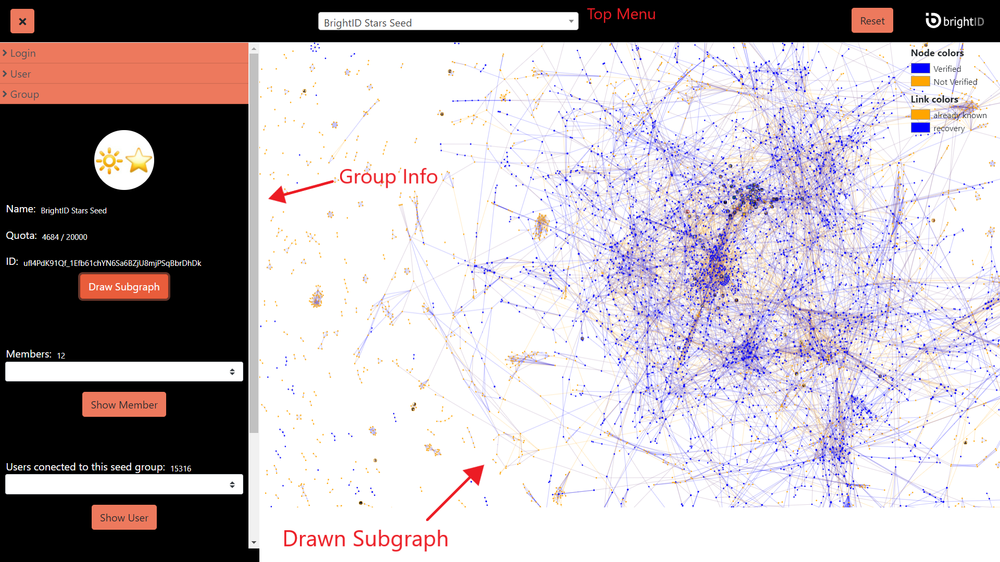

# Finding Seed Groups

BrightID has a [“Seed DAO”](https://aragon.idchain.one/#/seeddao) that grants seed status to groups that represent highly trusted and publicly known communities. Seed groups are listed in the top menu. Selecting a seed group highlights its members in blue and their connections in orange.

Group members and their connections will get listed under the “Group” section of the left menu when a seed group is selected. Seed groups are assigned a quota that defines the number of users they can assign “SeedConnected” verification. Total assigned and remaining amounts are also available in this section.

A sub-graph that is created from only group members and their connections can also be viewed using the “Sub-graph” button. To return back from the sub-graph to the complete graph, the “Reset” button on the top menu can be used.

To find out more statistics about seed groups and their activity, visit [“Seed Dashboard”](https://explorer.brightid.org/seeds/) which provides more details in charts and grids.

