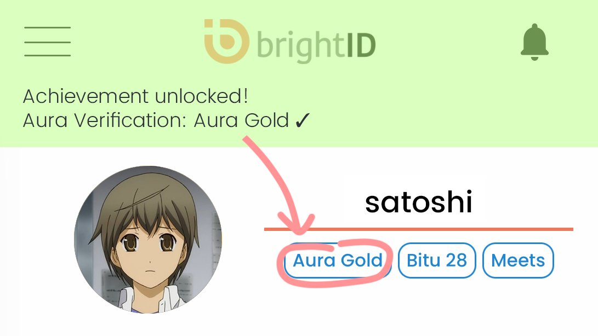

# 🟠 BrightID Verifications

You receive verification badges on your BrightID based on connections you make with your BrightID. The connections are represented in BrightID network infrastructure as an anonymous social graph. It is analyzed by the BrightID protocol to determine which kind of verification badges you are able to receive.

There are three kinds of verifications, two of which are complete(Meets and Bitu) and one is under development(Aura).

1. Meets verification
2. [Bitu verification](bitu-verification.md)
3. Aura verifications

<figure><figcaption>
BrightID Verification badges
</figcaption></figure>
