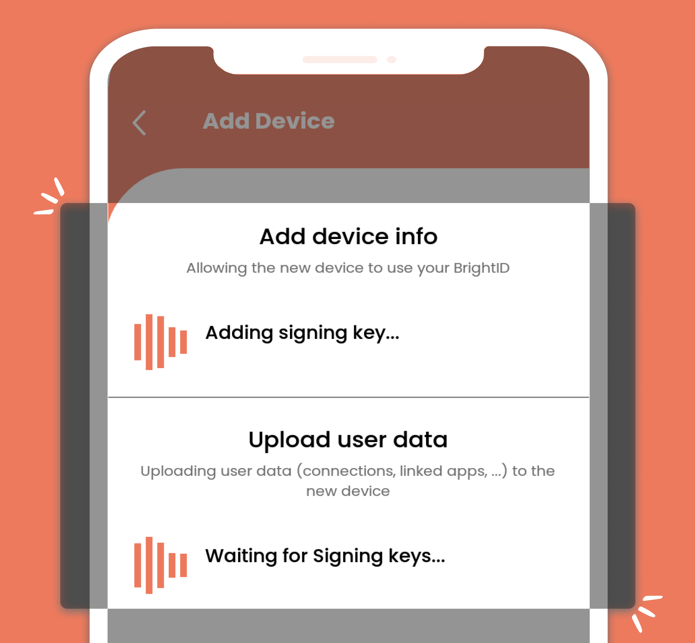
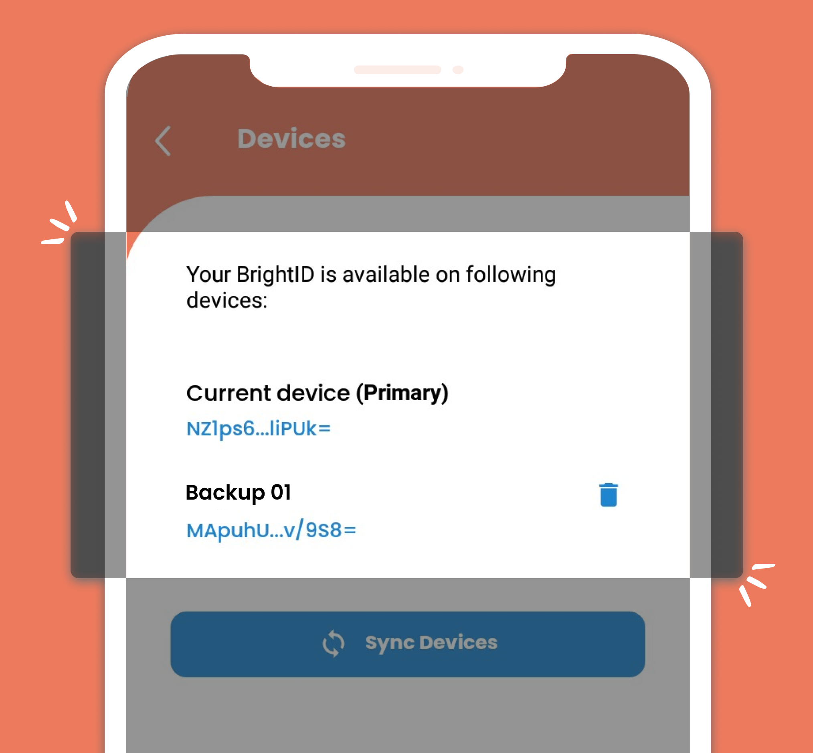
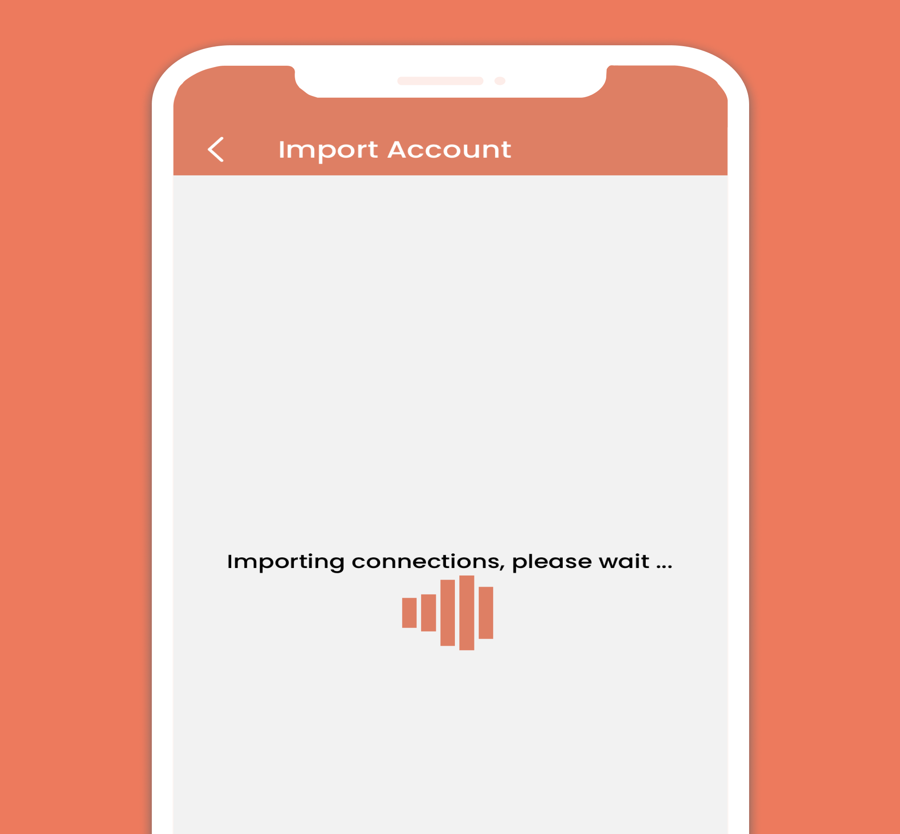

# Device Recovery

You can move your BrightID from one phone to another as long as you **still have access to the old phone that has your fully functioning BrightID**. This feature also allows the multi-device backup of your BrightID so that if you lose one, you still have your BrightID in another phone.


### Make sure BrightID on your old phone is up-to-date

Do not proceeding further before reading this alert completely and acting on it.\
\
Before starting recovery, make sure the original phone with the fully functioning BrightID has the same version of BrightID as your newly installed one in your new phone.

* If, for some reason, after updating, BrightID app in your old phone has an error saying signing keys are invalid/incorrect, then you cannot recover.
* It is very important for you to keep your BrightID mobile app in all your phones healthy and kept up-to-date. Follow us on Twitter at [@BrightIDProject](https://twitter.com/BrightIDProject), so you do not miss these important announcements. Then keep all of your devices up-to-date and in sync.

#### [Use the Update/Upgrade guide for important details on how to update BrightID on your old phone.](../update-upgrade.md)

* Proceed further only if your BrightID on your old phone is up-to-date and error free.


### Moving your BrightID to new phone

**Step 1.** Install the BrightID app on your new phone. After successfully installing, open the BrightID app and select the "Device Recovery" option - previously the button was labeled as "Import".

**Step 2.** After the QR Code appears on the new phone, note the following info:


### Primary/Secondary device

If you just want to move your BrightID to the new phone, select the **"set as primary device"** option above the QR code before you scan the code. Then your old phone BrightID is secondary.\
\
If you want your new device to be a backup or secondary, leave the option unchecked. Then your old phone BrightID remains primary.


<figure><figcaption></figcaption></figure>

**Step 3.** launch BrightID on your old phone. Select 'Scan a code' and scan the QR Code shown on your new phone.

**Step 4.** On your old phone, confirm that you want to export your BrightID to new phone. Then add the name of new phone. E.g., "Main"

<figure><figcaption></figcaption></figure>

**Step 5.** The app on your old phone will start adding your new phone and upload your data to the new phone. The process will take about 15-30 seconds.

**Step 6.** Once the process is done, your old phone will open the 'Devices' page and show the new phone successfully added to the list of devices.

**Step 7.** Have a look at your new phone. Wait for the app on your new phone to download your BrightID data. Once the process is finished, the app will open the home screen and you are done.


We suggest you double-check the **verification badge, number of connections, achievements,** and **apps linked** on your new phone. If you find some data <mark style="color:red;">**fails**</mark> to be transferred correctly from one device to another, please report it to us. It will help us notify the bugs on this new feature and solve it.\
\
Assuming you selected "set as primary device" above the QR code on your new phone in the step earlier, your new phone is now the "primary" device, and your old phone is your "secondary" device.


### Manage the list of Devices

To access the information on the list of devices with a copy of your BrightID, you can go to the side menu on your home screen in either phones and select 'Devices.' You can manually re-sync the data from your primary device to your secondary devices on this screen. You can also remove the devices you no longer want.


"Sync Devices" from your primary phone from time to time, especially if you change something, like your profile pic, name, connection level of a connection, or you added new connections.\
\
While you can still have a functioning BrightID on the phone that is not synced, and you can always redo the changes manually on your secondary/backup phone, it is obviously best not to have to repeat the changes.

