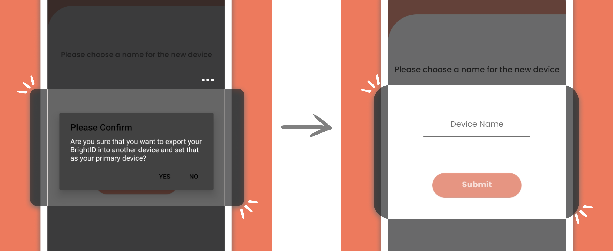

# 📲 Device Recovery

BrightID users can move their BrightID from one device to another without social recovery as long as they **still have access to the old device**. This feature also allows the multi-device backup of one BrightID account.

### How to import your BrightID account to other Devices?

**Step 1.** Install the BrightID app on your second device. After successfully installing, open the BrightID app on that device and select the 'Import Device' option.

**Step 2.** After the QR Code appears on the second device, open your primary device with your BrightID. Select 'Scan a code' on your primary device.


If you want to move your BrightID to the new device entirely, tick the **"set as primary device"** option above the QR code before you scan the code.


<figure><figcaption></figcaption></figure>

**Step 3.** Scan the QR Code shown on your second device.

**Step 4.** On your primary device, confirm that you want to export your BrightID to another device. Then add the name of this second device. E.g., Backup 01

<figure><figcaption></figcaption></figure>

**Step 5.** The app on your primary device will start adding your second device and uploading your data from the primary device to the second device. The process will take about 15-30 seconds.

**Step 6.** Once the process is done, your primary device will open the 'Devices' page and show the second device successfully added to the list of devices that link to your BrightID.

.png>)

**Step 7.** Have a look at your second device. Wait for the app on your second device to import the account. Once the process is finished, the app will open the home screen of your BrightID account.


We suggest you double-check the **verification badge, number of connections, achievements,** and **apps linked** on your second device. If you find some data <mark style="color:red;">**fails**</mark> to be transferred correctly from one device to another, please report it to us. It will help us notify the bugs on this new feature and solve it.


### Manage the list of Devices

To access the information on the list of devices connected to your BrightID, you can go to the side menu on your home screen and select 'Devices.' You can manually re-sync the data from your primary device to your other devices on this page. You can also remove the devices you no longer want to be connected to your BrightID.
