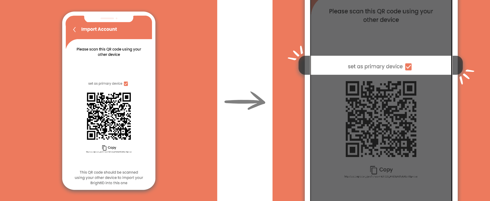

# 📲 Device Recovery

You can move your BrightID from one phone to another as long as you **still have access to the old phone that has your fully functioning BrightID**. This feature also allows the multi-device backup of your BrightID so that if you lose one, you still have your BrightID in another phone.

### Moving your BrightID to new phone

**Step 1.** Install the BrightID app on your new phone. After successfully installing, open the BrightID app and select the 'Import' option.

**Step 2.** After the QR Code appears on the new phone, launch BrightID on your old phone. Select 'Scan a code' on your old phone.


If you just want to move your BrightID to the new phone, select the **"set as primary device"** option above the QR code before you scan the code.


<figure><figcaption></figcaption></figure>

**Step 3.** With old phone, scan the QR Code shown on your new phone.

**Step 4.** On your old phone, confirm that you want to export your BrightID to new phone. Then add the name of new phone. E.g., "Main"

<figure><figcaption></figcaption></figure>

**Step 5.** The app on your old phone will start adding your new phone and upload your data to the new phone. The process will take about 15-30 seconds.

**Step 6.** Once the process is done, your old phone will open the 'Devices' page and show the new phone successfully added to the list of devices.

.png>)

**Step 7.** Have a look at your new phone. Wait for the app on your new phone to download your BrightID data. Once the process is finished, the app will open the home screen and you are done.


We suggest you double-check the **verification badge, number of connections, achievements,** and **apps linked** on your new phone. If you find some data <mark style="color:red;">**fails**</mark> to be transferred correctly from one device to another, please report it to us. It will help us notify the bugs on this new feature and solve it.\
\
Assuming you selected "set as primary device" above the QR code on your new phone in the step earlier, your new phone is now the "primary" device, and your old phone is your "secondary" device.


### Manage the list of Devices

To access the information on the list of devices holding your BrightID, you can go to the side menu on your home screen in either phones and select 'Devices.' You can manually re-sync the data from your primary device to your secondary devices on this page. You can also remove the devices you no longer want to have your BrightID in.
