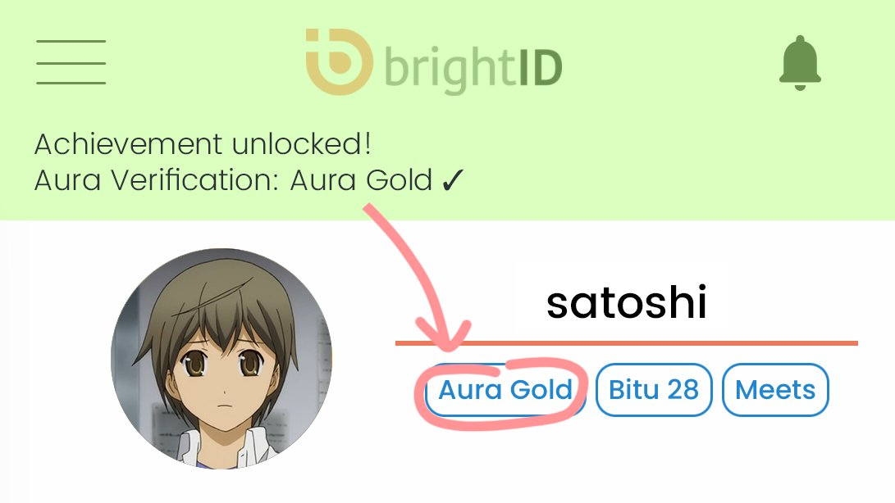

# ☑ Receive Verifications

You receive verification badges on your BrightID based on [connections you make](making-connections/). The connections are represented in BrightID network infrastructure as an anonymous social graph. It is analyzed through each of the verification protocols to determine which kind of badges your connections represent. If you do not have the right kind of connections a protocol seeks, you will not receive the kind of badge that the protocol depends upon. If you have not received any, the app will say "Verifications: none".\
\
Furthermore, different [apps](../linking-brightid-to-applications.md) require you to have different verification badges. So far most of them check if you have the [Meets verification](meets-verification/).

There are so far three kinds of verifications, two of which are live ([Meets](meets-verification/) and [Bitu](bitu-verification.md)), and one is under development (Aura).

1. [Meets verification](meets-verification/)
2. [Bitu verification](bitu-verification.md)
3. [Aura verifications](https://brightid.gitbook.io/aura/intro/readme)

<figure><figcaption>
BrightID Verification badges
</figcaption></figure>

